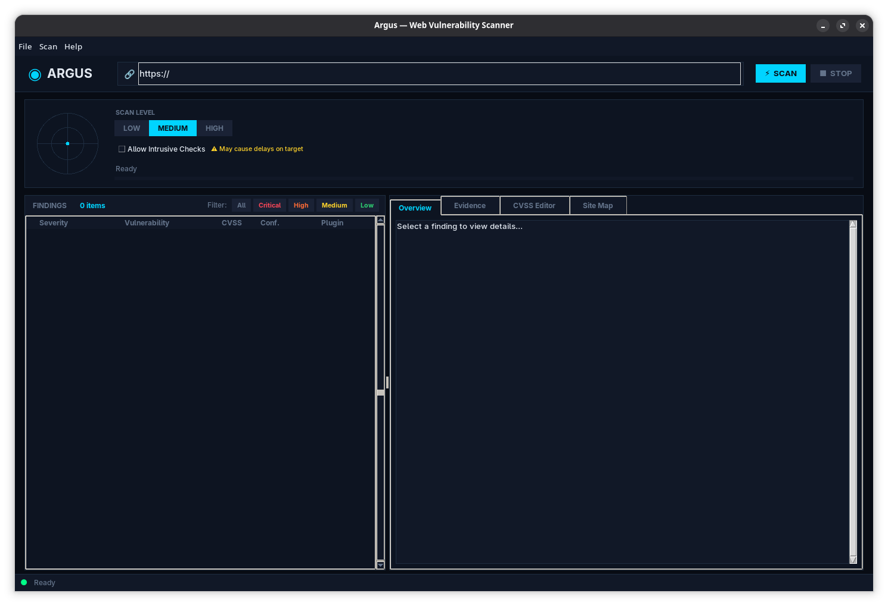

<div align="center">

# 🛡️ Argus — Professional Web Vulnerability Scanner

**A modular, plugin-driven web vulnerability scanner with a Burp Suite-style GUI and CVSS v3.1 scoring.**

[](https://www.python.org/)
[](LICENSE)
[](#-vulnerability-plugins)
[](https://www.first.org/cvss/)

<!-- 📸 Attach a screenshot of the main GUI window here -->
<!--  -->

</div>

---

## 📖 Overview

**Argus** is a professional-grade web vulnerability scanner built in Python. It combines an intelligent web crawler, a rich library of vulnerability detection plugins, and a beautiful Tkinter GUI inspired by Burp Suite. Argus automatically crawls your target, discovers the full attack surface, runs layered security checks, calculates industry-standard CVSS v3.1 scores, and produces polished reports in HTML, PDF, JSON, and CSV formats.

> ⚠️ **Legal Notice:** Only scan systems you own or have explicit written permission to test. Unauthorized scanning is illegal and unethical.

---

## ✨ Features

| Feature | Details |
|---|---|
| 🕷️ **Smart Web Crawler** | BFS crawling with depth & URL limits, robots.txt/sitemap.xml parsing, JavaScript URL extraction, sensitive file probing |
| 🔌 **Plugin Architecture** | 20+ plugins across Low / Medium / High / Intrusive tiers; add your own by subclassing `PluginBase` |
| 📊 **CVSS v3.1 Scoring** | Automatic score calculation, manual analyst override, full audit trail per finding |
| 🖥️ **Burp Suite–style GUI** | Scan panel, findings table with severity filters, detail tabs, and a live Site Map view |
| 📄 **Rich Reporting** | One-click export to **HTML**, **PDF**, **JSON**, **CSV** |
| 🧩 **CLI Mode** | Full-featured command-line interface for automation and CI/CD pipelines |
| 🛑 **Safe by Default** | Non-destructive scanning unless `--intrusive` is explicitly enabled |

---

---

## 🗂️ Project Structure

```
Argus/
├── main.py                    # Entry point — GUI or CLI
├── reports/                   # Auto-generated scan reports
└── src/
    ├── core/
    │   ├── scanner.py         # Main scan orchestrator
    │   ├── crawler.py         # BFS web crawler / attack surface discovery
    │   └── cvss_calculator.py # CVSS v3.1 score engine
    ├── plugins/
    │   ├── base.py            # PluginBase abstract class
    │   ├── loader.py          # Dynamic plugin discovery & loading
    │   ├── low/               # Low-severity checks (8 plugins)
    │   ├── medium/            # Medium-severity checks (9 plugins)
    │   ├── high/              # High-severity checks (7 plugins)
    │   └── intrusive/         # Time-based / intrusive checks (2 plugins)
    ├── models/
    │   ├── finding.py         # Finding & Evidence data classes
    │   ├── scan_context.py    # ScanContext, AttackSurface, Form, Cookie, …
    │   └── cvss.py            # CVSSMetrics & CVSSResult data classes
    ├── reporting/
    │   └── exporter.py        # HTML / PDF / JSON / CSV report exporter
    ├── ui/
    │   └── main_window.py     # Tkinter GUI application
    └── wordlists/             # Payload wordlists for each plugin category
        ├── xss.txt
        ├── sql_injection.txt
        ├── command_injection.txt
        ├── directory_traversal.txt
        ├── ssrf.txt
        └── …
```

---

## 🔌 Vulnerability Plugins

### 🟢 Low Severity
| Plugin | Description |
|---|---|
| `security_headers` | Missing or misconfigured HTTP security headers (CSP, HSTS, X-Frame-Options, …) |
| `cookie_misconfig` | Cookies lacking `HttpOnly`, `Secure`, or `SameSite` attributes |
| `version_disclosure` | Server/framework version numbers leaked in headers or responses |
| `information_leakage` | Sensitive data (stack traces, debug info) exposed in responses |
| `directory_indexing` | Open directory listings on web server |
| `sensitive_files` | Common sensitive files accessible (`.env`, `.git/config`, `robots.txt`, …) |
| `email_disclosure` | Email addresses exposed in page source |
| `weak_cors` | Overly permissive CORS policy |

### 🟡 Medium Severity
| Plugin | Description |
|---|---|
| `reflected_xss` | Reflected Cross-Site Scripting |
| `stored_xss` | Stored (Persistent) Cross-Site Scripting |
| `csrf` | Missing CSRF protection on forms |
| `open_redirect` | Unvalidated redirect / open redirect |
| `directory_traversal` | Path traversal attacks (`../`) |
| `file_upload` | Dangerous file upload without proper validation |
| `auth_bypass` | Authentication bypass via forced browsing / parameter tampering |
| `api_misconfig` | API endpoint misconfiguration / unauthenticated access |
| `subdomain_takeover` | Dangling DNS / subdomain takeover indicators |

### 🔴 High Severity
| Plugin | Description |
|---|---|
| `sql_injection` | Error-based and boolean-based SQL Injection |
| `command_injection` | OS command injection |
| `ssrf` | Server-Side Request Forgery |
| `xxe` | XML External Entity injection |
| `rce_indicators` | Remote Code Execution indicators |
| `insecure_deserialization` | Unsafe object deserialization |
| `privilege_escalation` | Horizontal / vertical privilege escalation checks |

### ⚠️ Intrusive (Opt-in)
| Plugin | Description |
|---|---|
| `time_based_sqli` | Time-delay SQL injection (e.g., `SLEEP`, `WAITFOR DELAY`) |
| `blind_command_injection` | Out-of-band / time-based command injection detection |

---

## 🚀 Installation

### Prerequisites

- Python **3.8+**
- `pip`

### 1. Clone the repository

```bash
git clone https://github.com/itzmeshervin/argus.git
cd argus
```

### 2. Install dependencies

```bash
pip install -r requirements.txt
```

> **Core dependencies:** `requests`, `beautifulsoup4`, `lxml`, `jinja2`, `reportlab`, `urllib3`

---

## 💻 Usage

### GUI Mode (recommended)

```bash
python main.py
```

### CLI Mode

```bash
# Basic scan
python main.py -u https://example.com

# Full high-severity scan with HTML report
python main.py -u https://example.com -l high -o report.html

# Enable intrusive checks (time-based SQLi, blind command injection)
python main.py -u https://example.com -l high --intrusive

# Export to specific format
python main.py -u https://example.com -f json -o result.json

# Verbose output
python main.py -u https://example.com -v
```

### CLI Options

| Flag | Description | Default |
|---|---|---|
| `-u`, `--url` | Target URL | *(required for CLI)* |
| `-l`, `--level` | Scan level: `low`, `medium`, `high` | `medium` |
| `--intrusive` | Enable intrusive time-based checks | `false` |
| `-o`, `--output` | Output file path | auto-generated |
| `-f`, `--format` | Report format: `html`, `json`, `pdf`, `csv`, `all` | `html` |
| `-v`, `--verbose` | Enable verbose debug logging | `false` |
| `--gui` | Force GUI mode | `false` |

---

## 📊 Scan Levels

```
low    →  Security headers, cookies, info disclosure, CORS, sensitive files
medium →  All low checks + XSS, CSRF, open redirect, auth bypass, file upload, API misconfig
high   →  All medium checks + SQLi, command injection, SSRF, XXE, RCE, deserialization
```

Add `--intrusive` to any level to enable time-delay based detection (increases scan time significantly).

---

## 📄 Reports

Argus generates professional reports in multiple formats, saved to the `reports/` directory.

| Format | Contents |
|---|---|
| **HTML** | Styled, printable report with severity badges, evidence blocks, CVSS vectors, remediation steps |
| **PDF** | Print-ready PDF via ReportLab, suitable for client delivery |
| **JSON** | Machine-readable full report including attack surface data |
| **CSV** | Spreadsheet-friendly summary of all findings |

---

## 🏗️ Architecture

```
main.py
  └── VulnerabilityScanner (core/scanner.py)
        ├── WebCrawler (core/crawler.py)
        │     └── AttackSurface (models/scan_context.py)
        │           ├── URLs
        │           ├── Forms & Parameters
        │           ├── Cookies
        │           ├── API Endpoints
        │           └── File Upload Endpoints
        ├── PluginLoader (plugins/loader.py)
        │     └── PluginBase subclasses (plugins/{low,medium,high,intrusive}/)
        │           └── Finding (models/finding.py)
        ├── CVSSCalculator (core/cvss_calculator.py)
        │     └── CVSSMetrics → CVSSResult (models/cvss.py)
        └── ReportExporter (reporting/exporter.py)
              └── HTML / PDF / JSON / CSV
```

### Design Principles

- **Plugin isolation** — Each plugin gets only the `ScanContext`; plugins never touch CVSS math.
- **Threaded execution** — Plugins run in a `ThreadPoolExecutor` (10 workers default) for speed, with a configurable rate-limit to avoid overwhelming targets.
- **Audit trail** — Every CVSS score change (automatic or analyst override) is recorded with a timestamp.
- **Safe defaults** — Intrusive checks (time-based delays, active payload injection) are disabled unless explicitly opted in.

---

## 🔧 Writing a Custom Plugin

```python
from src.plugins.base import PluginBase, PluginMetadata
from src.models.finding import Finding
from src.models.scan_context import ScanContext
from typing import List

class MyPlugin(PluginBase):

    @property
    def metadata(self) -> PluginMetadata:
        return PluginMetadata(
            name="My Custom Check",
            id="custom_001",
            severity_hint="medium",
            author="Your Name",
            description="Detects XYZ vulnerability."
        )

    def analyze(self, context: ScanContext) -> List[Finding]:
        findings = []
        for url in context.attack_surface.urls:
            # ... your detection logic ...
            if vulnerable:
                findings.append(self.create_finding(
                    vuln_name="XYZ Vulnerability",
                    short_intro="A brief description.",
                    description="Full description...",
                    affected_endpoints=[url],
                    impact=["Data exposure"],
                    proof_of_concept=["Step 1: ...", "Step 2: ..."],
                    evidence=[{"request": "GET /...", "response": "..."}],
                    remediation=["Apply patch X"],
                    references=["https://owasp.org/..."],
                    confidence="High",
                    suggested_cvss={"AV": "N", "AC": "L", "PR": "N",
                                    "UI": "N", "S": "U", "C": "H",
                                    "I": "H", "A": "N"}
                ))
        return findings
```

Drop the file into `src/plugins/medium/` (or `low`/`high`) and it will be auto-discovered on the next scan.

---

## 🤝 Contributing

Contributions are welcome! To add a new vulnerability plugin:

1. Fork the repository
2. Create your plugin in the appropriate severity folder under `src/plugins/`
3. Add any payloads to a new file in `src/wordlists/`
4. Open a pull request with a description of what the plugin detects

Please ensure your plugin:
- Inherits from `PluginBase`
- Returns valid `Finding` objects via `create_finding()`
- Does **not** compute or print CVSS scores (the engine handles this)
- Is marked `intrusive=True` if it sends time-delay payloads

---

## 📜 License

This project is licensed under the **MIT License**. See [LICENSE](LICENSE) for details.

---

<div align="center">

Built with ❤️ for the security community.  
*Argus — the all-seeing guardian.*

</div>
